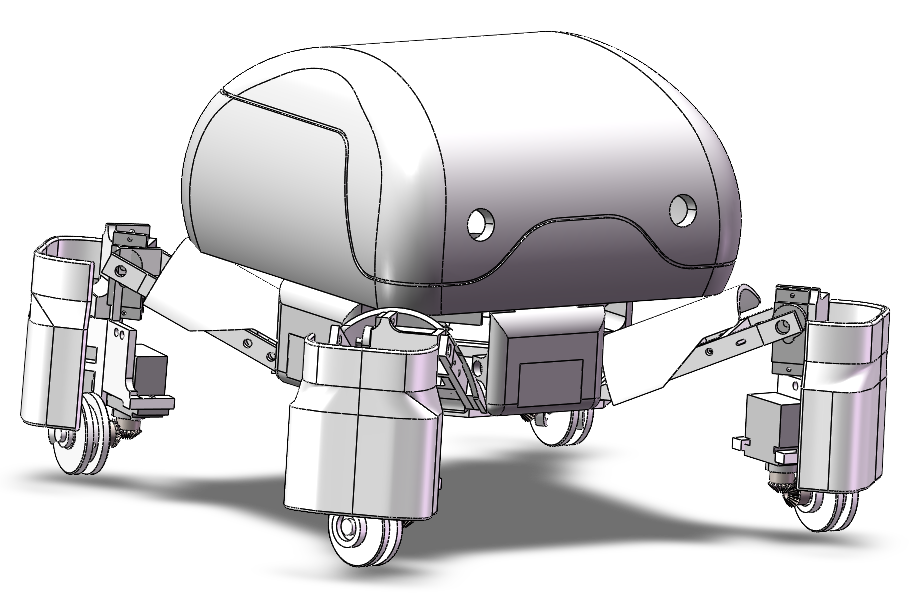
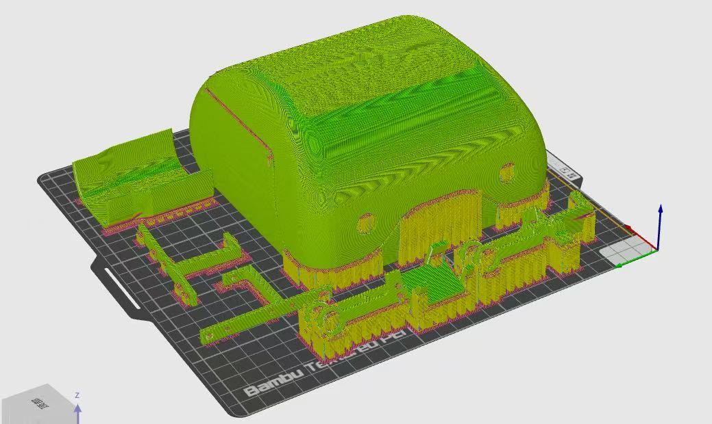

# Flycatcher-Robot

> 愛すべきお客様に、ハートフルな今日と、最高の笑顔を。

  

This project is a replica of the Flycatcher Robot from the anime *Apocalypse Hotel*, designed as an open-source desktop-level quadruped robot. 

The majority of the hardware in this project consists of available standard items with links or 3D-printing parts. The CAD Model, BOM List, and assembly notes are provided.

## CAD Model

  
  

[Check the STL/STEP files here](https://github.com/yanwen-zou/Flycatcher-Robot/tree/main/model)

It is recommended to print using PLA and with tree support.

## BOM List

### Mechanical Parts

| Part Name             | Link                               | Quantity | Price   | Notes                                   |
| --------------------- | ---------------------------------- | -------- | ------- | --------------------------------------- |
| mg90s servo 360 degrees | [Link](https://item.taobao.com/item.htm?_u=920cia0fifc95d&id=939629018237&pisk=gnI_Gv4yGsIE_eQJ5nyEPNWBnb-cGJrzDx9AEtnZHhK9lmBNNKo2uPvjcB68ICz0Ss_CM6Yw6I82cK1ytOo4IOybctBJ6n7w_KCFG60N_iRVTo6lNFoNHikG-_W-bGzM0mtwmnFzaurrIOxDDW7PpOhivdJ40jdtWhxKaCMayurPIODwB8WL4NWaFZJnkmCvW9npQBhx6cCvJepW9cpxXKhLdKApDKnvkvLpnK0vHICYvBpwUKH9DFHpJKpkDICvkpeBnBp9DnCApJ9DG7zvhVO1C8V_fcgLarBwOmnAApdMi1g-0pseCSd5CB93tMp_ZQB9OmnXwCwWYtCYGm-Rr6sXypEjhp_5psAOBoMXda6dOUSETg7r4QsT5qMBrmpISJwIoq4gjIxUEegwlFpHCO2QdfTDWpvBmJwIoqY9KdTUdJG6o&spm=a1z09.2.0.0.7aac2e8dMzZkOZ) | 4      | ¥54.00  | For wheels                               |
| mg90s servo 180 degrees | [Link](https://item.taobao.com/item.htm?_u=920cia0fifc95d&id=939629018237&pisk=gnI_Gv4yGsIE_eQJ5nyEPNWBnb-cGJrzDx9AEtnZHhK9lmBNNKo2uPvjcB68ICz0Ss_CM6Yw6I82cK1ytOo4IOybctBJ6n7w_KCFG60N_iRVTo6lNFoNHikG-_W-bGzM0mtwmnFzaurrIOxDDW7PpOhivdJ40jdtWhxKaCMayurPIODwB8WL4NWaFZJnkmCvW9npQBhx6cCvJepW9cpxXKhLdKApDKnvkvLpnK0vHICYvBpwUKH9DFHpJKpkDICvkpeBnBp9DnCApJ9DG7zvhVO1C8V_fcgLarBwOmnAApdMi1g-0pseCSd5CB93tMp_ZQB9OmnXwCwWYtCYGm-Rr6sXypEjhp_5psAOBoMXda6dOUSETg7r4QsT5qMBrmpISJwIoq4gjIxUEegwlFpHCO2QdfTDWpvBmJwIoqY9KdTUdJG6o&skuId=6002714282708&spm=a1z09.2.0.0.7aac2e8dMzZkOZ) | 4      | ¥51.60  | For leg joints                            |
| Mini bevel gear        | [Link](https://item.taobao.com/item.htm?_u=920cia0fifd05c&id=802831128052&pisk=g_AUTm4NE_x1kWqsOhCzueGrVJSdh_ojqQs5rUYlRMjnewGuaU8cP2n-Jd7kVh3-J6Tl43-1X7_Sp0FybHTDd9tWdgbljhYQOgGdU38XD3NS9p_uahTRE3Oyy77kr33dV2BeJeCRZmiXajTpJPqfI9AFrNqMWZZhqA63Lf8I5mijGjM3S_oEce1ySd9GuZfl-_bosV7f-8flEwYi7ab7x8VHqF0NXaZlr7XkSGbVP7fuZ_XgSabP-aVlZ5XGXaflq3fo71jOr_jkq_AUpOWq_ZXn5T5wi0oQB6ID-GPugFIdtuT0FWPFkwBUpcITZNON89SD8I2kSnQynIWpmcwCxK5H06vZjW5BYCxVtdogTsvvR6sPmuQgtrdJLu2lK7_NcVuwnsCfHZhMiyw8eOx57igpJ8eRK9_NcVuae8BGMNSjJeC..&spm=a1z09.2.0.0.7aac2e8dMzZkOZ) | 4      | ¥42.40  | 0.5 module, 20 teeth, 4mm shaft hole, fixed to the wheel and coupled with servos |
| Servo bevel gear       | [Link](https://item.taobao.com/item.htm?_u=920cia0fife739&id=924233815457&pisk=gsoYTWX3XLBvce1VHfYkShFwA4mAkUDqUjkCj5Vc5bh-6vBmoPVg5lhE9PsMuo4TXbNomSD0cRassXg0GqVGXchrMijgcfxT1vuyQS2mmOesPjIioxVmyOEqqqjgiIrtCX49tBxHxxk40lOHt3vEv0EQpi11srMWVl2trx_cdxk4bl6l1e0S3hUww_8_C598VRyhhlwffa98BJF_fSa1NawQN5Zs1P67P-yg1iw_5898nRj_CSNfFuw3dZ1j1l9-F7y_f-G_fLH7aRObxMNWh5stuWavyGp6nZbm2-UY6m2PWVnGxPVCn7sOXdb8uWt3wGss2-M_dwZFcHFSoVi0VmOWeuixMma-iFsLVmhxczhBZghN4ennvMVGtWeGkLn17NzbULYM_n5821KTeWvAON7arTy8tLLf7NzbU8FHHhQN7zXP.&skuId=6079562498001&spm=a1z09.2.0.0.7aac2e8dMzZkOZ) | 4      | ¥42.40  | 0.5 module, 20 teeth, 4mm shaft hole, installed on the servo |
| Knurled nuts           | [Link](https://item.taobao.com/item.htm?_u=920cia0fif48e4&id=868299597594&pisk=gtaUTNAZq426ZTv1RR3ygW_PFHkKb4WfEzMSZ7VoOvDh2X_kz7PmN6BR9lluFRCR92NoU8ysBUG5vTLzQJN0ADw7AYcoIRVBRY_K48PbH8T5JkGkzRN-q8azwUluZ8CKF6nU9W3-rt6bzZNL9CvjjD4EtAcg6jDoZGiHYNPC1t6flZsHs4WFhWgzilqigj0ot4Y3s1loip0oqXVG_bcWK3Y3E5fZBb9oZUmusAcqNU0krbAijXGexBYntNciBb0ot80l_VDtZ4DuE4AF_coV7jmh10uaoT-H9Xk0tA8ku5Hq-N2HVFTsJXnevNH9rfaZTDk0Trxus-hzmroLnOtIKou332qNIeuQLP2q-lWM8qqYO2sPmLhM-IU8YLxoxUGZh15amq3jDjQgoBtJ2c2S_x1L93K-xDGZh15w23nikfkf9WC..&spm=a1z09.2.0.0.7aac2e8dMzZkOZ) | 20     | ¥0.60  | 3*3*4.1                                 |
| Wheel                 | [Link](https://item.taobao.com/item.htm?_u=920cia0fif4f47&id=851325146722&pisk=giaaGVAEmq2BZiJC5J32a59Gz2MtWqW5nrMjiSVm1ADGDf_DuSPoG1BA6kl0hJCA6VNm3-yIpEGfXtL4LRNufcwbfxcmKJV65x_t0-P7e-TfWlGDuJNxm-a4MEl0i-Cth1na653xoT67uaNT61ja1_UZiW039b9mnMiMbwP1OT65PasMtqWNF5gqKHynab0msqcMt6lrgK0mmq0hTjcXInYgnWfEpjLmnEYDxpcosK0Dof0nKjlrsEcDSDmnpj0miF20t6ljKx0mo-VH9CiE4wloj6iqV-c2C-iZE5DezQUmIMHPyvLcMycwFXFGDEY08fog8Rb2CKg0j5wEVlWy7kVgQumuSaK-j52aq04G7LHI2g7MHXYMwrEwnnmMlXk5T6roy4i-ww4k1nKxx-GEF1F9DnnifXk5T6-vDD0-TY1T6&spm=a1z09.2.0.0.65e12e8dTZdetY) | 4      | ¥44.00  | Outer diameter 30mm, groove width 4mm, thickness 10mm, width 6mm, inner hole |

### Electronics

| Part Name             | Link                               | Quantity | Price   | Notes                                   |
| --------------------- | ---------------------------------- | -------- | ------- | --------------------------------------- |
| 24-channel Servo Controller | [Link](https://item.taobao.com/item.htm?_u=920cia0fif2ddb&id=549015493634&pisk=g8cLM_b0wFQpaqSFJ0vMEQEyGAcpyd0E7DufZuqhFcnt2qQnK8quF7nqD81kLW28wcZitk03OzwSqmM3AvqlwbnZv6fuO0A8Vqkwzk4ntaUSCDCoK2qnBaFEsvfuxHP-Pm2JmnADi2uUT7tDmCYqMfFbo66Cqz1_C74-I26hl2uUa76SQ29t8Qeyb3x7PuTT1zz4R7wQFOs_bzXQV0ZQCGaYu7ZSV0w15zUQPuZQPRa_brC5R7wC1Pa3zT1QV0g6WzauNui7dF3_bzN7VBR1GlTQV_HUcJpOwO81lZGTJJE-tzW83vf09oaQf_awwy2dK2ZON_GsFWdIEodOfl0SuYwtwTp7WX3xwPu9Htat9qh8yb-y6gkKijC0qiqYr9LtNTWzdP8ME3RFX5IJwPEDJi6PURbaWoY9dTWzdPzTmedRUTyG7&spm=a1z09.2.0.0.7aac2e8dMzZkOZ&skuId=5268728850417) | 1      | ¥105.00 | For controlling servos                    |
| Joystick Controller       | [Link](https://item.taobao.com/item.htm?_u=920cia0fif2ddb&id=549015493634&pisk=g8cLM_b0wFQpaqSFJ0vMEQEyGAcpyd0E7DufZuqhFcnt2qQnK8quF7nqD81kLW28wcZitk03OzwSqmM3AvqlwbnZv6fuO0A8Vqkwzk4ntaUSCDCoK2qnBaFEsvfuxHP-Pm2JmnADi2uUT7tDmCYqMfFbo66Cqz1_C74-I26hl2uUa76SQ29t8Qeyb3x7PuTT1zz4R7wQFOs_bzXQV0ZQCGaYu7ZSV0w15zUQPuZQPRa_brC5R7wC1Pa3zT1QV0g6WzauNui7dF3_bzN7VBR1GlTQV_HUcJpOwO81lZGTJJE-tzW83vf09oaQf_awwy2dK2ZON_GsFWdIEodOfl0SuYwtwTp7WX3xwPu9Htat9qh8yb-y6gkKijC0qiqYr9LtNTWzdP8ME3RFX5IJwPEDJi6PURbaWoY9dTWzdPzTmedRUTyG7&spm=a1z09.2.0.0.7aac2e8dMzZkOZ&skuId=5268728850417) | 1      | ¥41.60  | Includes 6P cable, receiver, and adapter board |
| Battery and Charger   | [Link](https://item.taobao.com/item.htm?_u=920cia0fif2ddb&id=549015493634&pisk=g8cLM_b0wFQpaqSFJ0vMEQEyGAcpyd0E7DufZuqhFcnt2qQnK8quF7nqD81kLW28wcZitk03OzwSqmM3AvqlwbnZv6fuO0A8Vqkwzk4ntaUSCDCoK2qnBaFEsvfuxHP-Pm2JmnADi2uUT7tDmCYqMfFbo66Cqz1_C74-I26hl2uUa76SQ29t8Qeyb3x7PuTT1zz4R7wQFOs_bzXQV0ZQCGaYu7ZSV0w15zUQPuZQPRa_brC5R7wC1Pa3zT1QV0g6WzauNui7dF3_bzN7VBR1GlTQV_HUcJpOwO81lZGTJJE-tzW83vf09oaQf_awwy2dK2ZON_GsFWdIEodOfl0SuYwtwTp7WX3xwPu9Htat9qh8yb-y6gkKijC0qiqYr9LtNTWzdP8ME3RFX5IJwPEDJi6PURbaWoY9dTWzdPzTmedRUTyG7&spm=a1z09.2.0.0.7aac2e8dMzZkOZ&skuId=5697584609067) | 1      | ¥81.60  | Battery and charger                       |
| LED Light             | [Link](https://item.taobao.com/item.htm?_u=920cia0fif937f&id=566087904384&pisk=gjS4GHMyShf7VYG7c_KZLtZa1qRvahPQsGO6IOXMhIA0WKZibOWHC-FTHaJG1_eTHn6M_15Wwc9_k5nNas6hlE11lCvMZ_XjcCZv71WC91i_DZ9ib_69S1sNBcJGI1ev1-LVHtK9jWNCbk6AHYcBrE2BnYqlepH0FE284l2yjWNQA4MkkStGhC-HVT3kpQvDsmY0U3vwQxxMSKXuUdvsiVmcsT2ywdGMIcYGEQveCcxMnd0lEKpKnCAMiYvkwdxijEfGE8J6ZCxMj1XkGPYy8uJHo8Tw4MVabxQ9ttArjDWJ9nDcTVgIRSvDkBqKgV3TBK82ttAug-lwWF52ugZq9K7lLpJVzR0kiTsVQK7zI4AcI9IdRgSi6LmmpGQqsVYmfLRQU87HvHTppujnhV39r19yO-BxWVLDlLRQU8utWUxpUBwAH&spm=a1z09.2.0.0.7aac2e8dMzZkOZ) | 2      | ¥0.70   | Robot eyes                               |
| Shading Plate         | [Link](https://detail.tmall.com/item.htm?_u=920cia0fif9e5c&id=924834751732&pisk=g5u7gFtadv3VsXoTVyRVf0lbtOz3JI8wJ6NKsXQP9zU8AwhrCW7UY3VCR-G9Z8-HqvijpxqzeJrURWManb7eZbRBRXhTeyozUWHqdxjrU2yE3eGiCu7r925omAlOz4-u8waz-ypwQF8NZb43JKoZMbBlk7VH87Edyz4AQ81yXF8ZZbfzwClv70lr6ZuFvwHL2jBYT-F89uIJGoFa9yQ8vaIAH-VLJyEdJoCYOWQRvkepGEFQ69Q8paQYk5F39yUKprLY97ULpvEJGje09yepG3-LOgwSNCvWPasAW3NLhwQKlSeuaYsPqRn7Ne2ZN-NDBmP5IRh8hwQQB8O_uXHpdwztjxgQXSLCOSisMv2-we1QGcGxhluV3gSP7RgJVM1bjwFfqIOfxMxkrJ42soszAuF0NbAXGTZ32SVb-IOfxMq8i7Z2GI67x&spm=a1z09.2.0.0.7aac2e8dMzZkOZ) | 2      | ¥2.40   | Applied inside the head part to make the eyes glow more naturally |

Note 1: For the electronics, you can choose different control methods based on your needs.

Note 2: For developers in regions where Taobao is not accessible, you can refer to the size parameters and features to purchase similar accessories from platforms more accessible in your region. If there is significant demand, I will also compile a list of Amazon links in the future.

## Assembly Notes

1. Most screws used in the assembly are M2*10.

2. Due to the complexity of the mechanism and the precision of 3D printing, the head and body connection currently uses hot melt glue for attachment. It is recommended not to install the head until control logic debugging is complete. Feel free to modify the design based on the current model for a more refined joint mechanism or easier disassembly and contribute your changes!

3. The thigh-to-body connection parts require the insertion of two knurled nuts, which can be easily done using needle-nose pliers and a small hammer.

4. Similar to step 2, the leg shell is also attached using hot melt glue, so it is recommended to install it last.

## Wiring and Control

You should follow the official documentation from Zhongling to connect the servo wires to the control board and define the joystick controller interfaces in the software. 

It is important to note that for the four servos controlling the wheels, their wires need to be extended.

